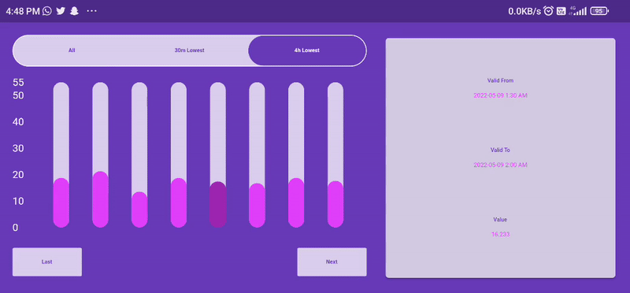
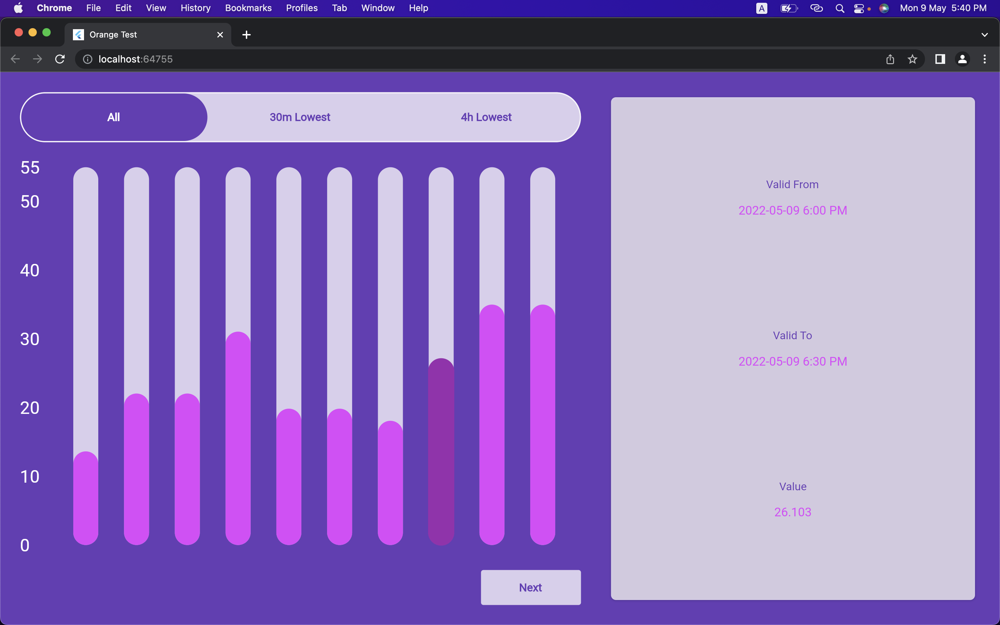
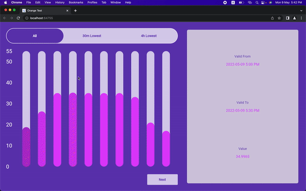

# Orange Test

This repo contains the code for test assignment from Orange Power.

# Building the project

1. Clone the repo
   
   ```git clone git@github.com:AlphaArtrem/orange_test.git```
2. Install Flutter
   
   ```https://docs.flutter.dev/get-started/install```
3. From the project root folder run the project by typing into terminal 
   
   ```flutter run```
   
   Choose device you want to run with.
4. Run test 
   
   ```flutter test test/test.dart  ```

# Previews

## Portrait


## Landscape



## Web



## Responsiveness

